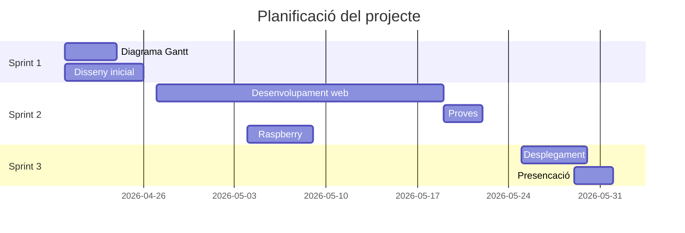

# Futra Diagrama de Gantt

## Integrants del porjecte
- Laia Marin Rosas

## Objectius
- Que els jugadors de mode carrera pugin planificar les seves tactiques
- Veure com competir contra diferents tactiques
- Aconseguir el millor jugador per el teu estil de joc

## Explicació del projcete
Es basa en una pàgina web per poder plafinicar les tactiques en mode carrera, veure quines formacions funcionen millor contra altres, caracteristiques claus de jugadors...

## Material del projecte
- Maquinari
  - Ordinador
  - Servidor al nuvol
  - Raspberry 

- Programari
  - Visual Studio Code
  - Eines de IA per ajudar
  - Llenguatges de programació

## Desenvolupament i desplegament
En aquest apartat heu d’explicar com s’ha construït tècnicament el projecte i com s’ha posat en funcionament. Cal descriure el procés de desenvolupament de l’app, les eines utilitzades i el desplegament tant de l’app com del servidor (configuració, publicació i verificació del funcionament).

(SIN ACABAR, SE ACABA AL ACABAR EL PROYECTO)

## Planificació
Aquest apartat ha de mostrar com heu organitzat el treball en el temps. Cal incloure les històries d’usuari, la divisió de tasques en sprints i el diagrama de Gantt amb la planificació temporal del projecte.

(SIN ACABAR, SE ACABA AL ACABAR EL PROYECTO)

## Annexos
Aquí s’ha d’afegir el material complementari que dona suport al contingut de la memòria principal, com evidències de feina, captures, diagrames, proves o altra documentació tècnica rellevant.