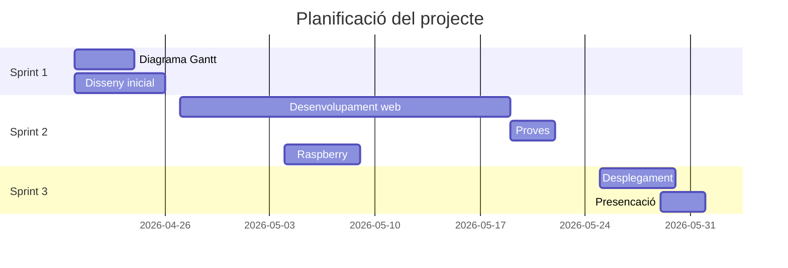

# Futra Diagrama de Gantt

## Integrants del porjecte
- Laia Marin Rosas

## Objectius
- Que els jugadors de mode carrera pugin planificar les seves tactiques
- Veure com competir contra diferents tactiques
- Aconseguir el millor jugador per el teu estil de joc

## Explicació del projcete
Es basa en una pàgina web per poder plafinicar les tactiques en mode carrera, veure quines formacions funcionen millor contra altres, caracteristiques claus de jugadors...

## Matrial del projecte
- 