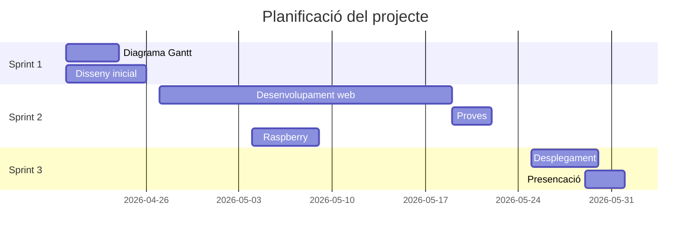

# Futra Diagrama de Gantt

```mermaid
gantt
  title Planificació del projecte
  dateFormat YYYY-MM-DD
  section Sprint 1
  Diagrama Gantt      :a1, 2026-04-20, 4d
  Disseny inicial     :a2, 2026-04-20, 6d
  section Sprint 2
  Desenvolupament web :b1, 2026-04-27, 22d
  Proves              :b2, after b1, 3d
  Raspberry           :b3, 2026-05-04, 5d
  section Sprint 3
  Desplegament        :c1, 2026-05-25, 5d
  Presencació         :c2, 2026-05-29, 3d
```

## Integrants del porjecte
- Laia Marin Rosas

## Objectius
- Veure les novetats sobre el mode carrera
- Revisar quins equips tenen la millor media
- Veure quins judaors són els més potents
- Pder saber quines són les tactiques per utilitzar a FC26

## Explicació del projcete
Es basa en una pàgina web per poder plafinicar les tactiques en mode carrera, veure quines formacions funcionen millor contra altres, caracteristiques claus de jugadors...

## Material del projecte
- Maquinari
  - Ordinador
  - Servidor al nuvol
  - Raspberry 

- Programari
  - Visual Studio Code
  - Eines de IA per ajudar
  - Llenguatges de programació

## Desenvolupament i desplegament

Primerament vaig comencar cerant un repositori a github, dins del repositori vaig crear un index.html y un index.css, a més també vaig preparar carpetes on estarien les seccions de la pàgina amb els seus arxius html i css, i en alguns casos JavaScript també vaig fer un deagrama de Gantt per poder organitzarme

Vaig començar amb l'inici i definint que és el que portaria cada apartat de la pàgina, després vaig crear la misma estructura per tots els apartatas i a partir d'aqui vaig comencar a retocar l'apartat de equips. Amb l'ajuda de algunes eines de IA vaig decidir quins serien els equips que escolliria i els seus valors com la valoració de l'equip, la lliga, el pais... un cop ja tenia tot l'apartat html vaig comencar amb el css per finalitzar amb aquest apartat, també vaig reciclar aquesta pagina per la de jugadors ja que volia unes caracteristiques molt similars a les de l'apartat de equips, també vaig fer un apartat per registrarte

Un cop fet tot l'anterior vaig acabar de concretar com volia exactament la pàgina prinipal, vaig decidir que seria un apartat de notcies sobre el modo carrera de FC26, vaig treure tota aquesta informació de la pàgina oficial de FC26, un cop tenia tota l'estructura html vaig acabar amb el css inplementant noves coses com per exemple el display: grid, que es com una caudricula y gràcies a això pots controlar files i columnes a la veguada, també vaig aprofitar i el vaig ficar al css dels altres apartats

Ja només quedaba acabar els apartats tacticas i alineaciones, que vaig utilitzar pràcticament la mateixa estructura html i el mateix css per les dues, la idea incial sobretot per l'apartat de alineaciones era ficar base de dades però desprès de revisar el temps que requeria i el temps del que jo disopnia vaig decidir no posar base de dades ja que no requeria tant de temps

Finalment vaig ficar JavaScript als apartats Equipos i Jugadores per poder utilitzar els filtres, també entre tot el procès de creació de la pàgina s'ha hagut de modificar una mica el diagrama de Gantt per alguns imprevistos i entre mitjes de les fases de la creació de pàgina vaig configurar i pujar la base del proyecte a la Raspberry.

## Planificació

Abans de començar el proyecte el primer que vaig fer va ser dividir totes les tasques en un diagrama de Gantt per poder oganitzarme, amb el pas del temps s'ha hagut de modificar ja que has sorgit imprevistos o problmes

Els sprints principls són: 
- Sprint 1: Diagrama de Gantt i Disseny inicial 
- Sprint 2: Dessenvolupament web, Proves i Raspberry
- Sprint 3: Desplegament i presentació

## Webgrafia

- Google fonts: https://fonts.google.com/specimen/Funnel+Display?categoryFilters=Feeling:%2FExpressive%2FCalm&preview.script=Latn
- Eines de Inteligencia Artificial per validar ideas, buscar informació i fer proves de funcionalitat
- Github: https://github.com/
- Canva: https://github.com/
- Noticies FC26: https://www.ea.com/es/games/ea-sports-fc/fc-26/features/fc-26-career-mode
- Google en general per buscar altre informació o fotografíes

## Annexos

Amb l'ajuda de les fonts digitals que he mecionat abans he pogut acabar el proyecte i fer proves per conprovar la seva funcionalitat